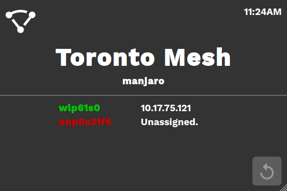

# Toronto Mesh Node Monitor

This is a small Python (Flask) web app designed to display the status of a node in the [Toronto Mesh Network](https://github.com/tomeshnet). It is intended to be run locally on a node and displayed on some kind of [LCD display](https://www.adafruit.com/product/1601) in a browser set to kiosk mode.


## To-Do:
- [ ] Add third column for IPv6 addresses
- [ ] Move to Tomesh GitHub organization
- [ ] Turn script into systemd service
- [ ] Make script a module for cjdns-prototype-pi
- [ ] Perform the same detections as the [status](https://github.com/tomeshnet/prototype-cjdns-pi/blob/master/scripts/status) bash script, and display the status of the following:
  - [ ] Mesh Point Interface
  - [ ] Yggdrasil
  - [ ] CJDNS
  - [ ] Mesh Adhoc
  - [ ] hostapd
  - [ ] IPFS
  - [ ] Node Explorer
  - [ ] Prometheus
  - [ ] Grafana
- [x] Setup a working Flask app
- [x] Detect the name, IP and up/down status of all physical network interfaces
- [x] Check for status / IP changes using async
- [x] Display the time in top right corner
- [x] Detect the hostname (Usually tomesh-xxxx in the case of a tomesh node)

## Setup
- Install Raspbian Lite on your Pi. Ensure SSH is enabled if you need it.

- Configure your LCD display. In my case I had to install drivers:
  ```bash
  git clone https://github.com/goodtft/LCD-show
  chmod -R 755 ./LCD-show && cd ./LCD-show
  ./MPI-3508-show
  ```
  
  Among other things, it modifies by `/boot/config.txt` by adding:
  ```
  hdmi_force_hotplug=1
  config_hdmi_boost=7
  hdmi_drive=2
  hdmi_force_hotplug=1
  hdmi_group=2
  hdmi_mode=87
  hdmi_cvt 480 320 60 6 0 0 0
  ```
- We assume you _do not_ already have a working X11 environment. We will be installing the minimum packages needed as not to consume unecessary resources.

  ```bash
  sudo apt install unclutter chromium-browser lxde git python3-pip
  ```
- Now obtain the source code for the monitor.

  ```bash
  git clone https://github.com/ranguli/tomesh-monitor && cd ./tomesh-monitor
  ```

- It's important that you use `pip3` and consequently `python3` for everything pertaining to this project.
  ```bash
  pip3 install --user -r requirements.txt
  ```

- Open `~/.config/lxsession/LXDE/autostart`
  ```
  @xset s off
  @xset -dpms
  @xset s noblank
  @unclutter & 
  @python3 /home/pi/tomesh-monitor/monitor.py &
  @sed -i 's/"exited_cleanly": false/"exited_cleanly": true/' ~/.config/chromium-browser Default/Preferences
  @chromium-browser --noerrdialogs --kiosk http://127.0.0.1:5000 --incognito --disable-translate
  ```
  
  If you want the full LXDE desktop environment to also load in the background (if you think you may want to use it) then keep/don't delete these lines:
  ```
  @lxpanel --profile LXDE
  @pcmanfm --desktop --profile LXDE
  @xscreensaver -no-splash
   ```

- Before rebooting, enable Desktop Autologin using ```sudo raspi-config```


